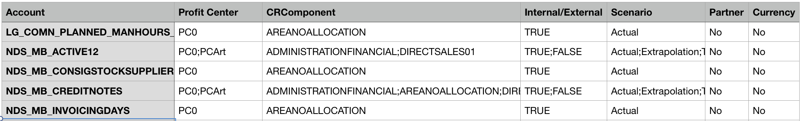
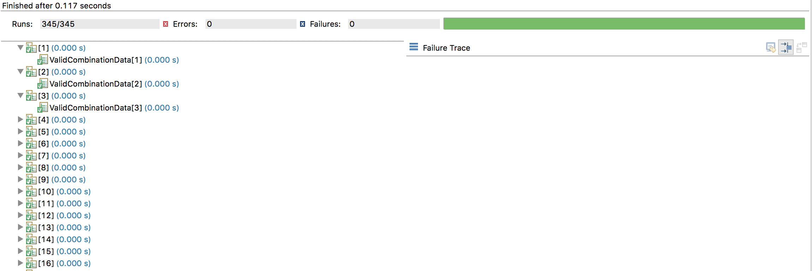

## Example 1
Kamolchanok Tangsri, Tsai Kun Hao, Ankita Sadu, Fabian Gand

This includes our solution for Example 1

## What we did
 The package _com.wuerth.phoenix.cis.university.example1_ contains our task1 solution. 
 
 We generated the rules of valid combination `MergedRules.csv` that was based on the data combination that WP gave us. 
 
 The class _InputGeneratorFromRulesDoc_ creates the valid combinations as `valid_combination.csv`. 
 
 Lastly, we use parameterized tests to assert the isValid method for each line in the valid_combinations file.

## How the reduction works
#### Input Combinations & CSV files:
     A CSV Reader and Writer that creates one file: 
        1. CSV Reader: MergedRules.csv, Account.csv, CRComponent.csv, and ProfitCenter.csv
        2. CSV Writer: valid_combinations.csv
#### How we reduced the combination
1. **MergedRules.csv** is the main file to determine the valid combination. There are 7 parameters that are involved in the combination.
   Total of combination without the MergedRules.csv is around 60,800 combinations. The challenge was to reduce this huge (~60,000) combinations. 

    Total: 121,600 combinations=AccountClass(5) x AccountType(19) x isPartnerAllowed(2) x Profit Center(2) x C/R Component (8) x External(2) x Scenario(5) x Partner(2) x Currency(2).
    
    There are **28** rules that we found out according to _Example1Combinations.doc_. We mapped the rules into _MergedRules.csv_.
    
    For example, Logistic account class concerns No Profit Center, isNotAllocated, External, Actual(Scenario), No partner, and No currency.
    
    Logistic(1) x AccountType(1) x isPartnerAllowed(2) x Profit Center(1) x C/R Component:isNotAllocated (1) x External(1) x Scenario(1) x Partner(1) x Currency(1).
    
    Thus, instead of testing 24,320 combinations for Logistic account class, we test just two combinations for Logistic account class.
    
2. **InputGeneratorFromRulesDoc.java** is an important class to generate valid combination according to rules. 

    There are `345` valid combinations which are written into `valid_combinations.csv`.

    2.1 Read all csv file (_MergedRules.csv_, _Account.csv_, _CRComponent.csv_, and _ProfitCenter.csv_)

        readCSV();
        
    2.2 Generate the valid combinations as method `generateRule()`. Each combination is one IData which is used to check `isValid(...)` in the test.
        
        generateRule()

## Important Classes for Reduction
 * _**MergedRules.csv**_
 Sample of rules
 
 
 
 * _**com.wuerth.phoenix.cis.university.example1.input.InputGeneratorFromRulesDoc**_
 
 Generate the 345 valid combinations
 
 * _**com.wuerth.phoenix.cis.university.example1.input.CSVReader**_
 
 Read and Write CSV file

## Testing Strategies
* JUnit4
* DataTest.java
    1. Read the valid combinations from the csv files
    2. Use `Parameterized` to run each combination.
    3. Assert `assertEquals` to "true" as the valid combination after passing the combination into `example1Checker.isValid(combination)`

 
## Results
* The test has run 0.117 seconds.
* All of the combinations, 345, are valid without any error or failure.
* The figure below shows the result running on JUnit: 

