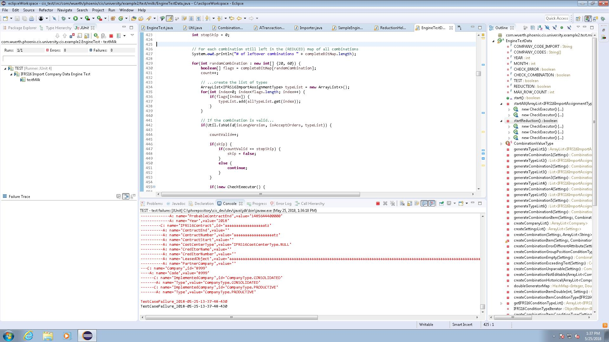
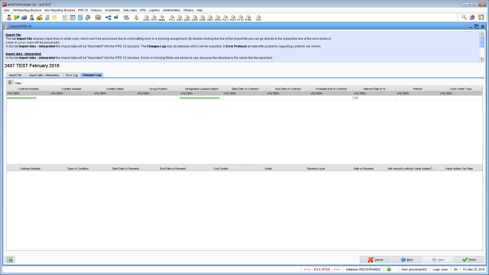

# Example 2
_Kamolchanok Tangsri, Tsai Kun Hao, Ankita Sadu, Fabian Gand_

This includes our solution for Example 2.

## What we did

The package _com.wuerth.phoenix.cis.university.example2.test.milk_ contains our solution.
It based on the last latest version we received from WP. Instead of testing all possible combinations
and the six combinations that were extracted to cover them all and switching between the two versions
we decided to combine them. __This method was introduced by our group__.
This is a method to check whether the six combinations really cover all of the possible ones.
At the company, we found that 8 combinations were in fact not covered. These have to be added to the execution manually.
In our proposed solution the remaining combinations are executed automatically.
__All our changes are also commented in the code.__

## How the reduction works
__In com.wuerth.phoenix.cis.university.example2.test.milk.EngineTestData__
1. We take the list that contains the bitmap of all possible combinations.
```
createCombinations(allTypeList.size())
```

2. We execute the 6 combinations that cover all the others (given by WP).
3. After every execution, all of the combinations that contain the just executed combination (executed combinations = subset) are removed.
All of these operations are performed on bitmaps. This requires a bit of "casting" but it greatly increased performance. 
The operations are not possible when they are performed with Collections since they create an OutOfMemoryError on the VM at WP.
```
// After executing each iteration -> remove all combinations that contain the executed combination
completeBitMap = ReductionHelper.generateReducedBitMap(completeBitMap, ReductionHelper.generateBitmapForTypeList(allTypeList, typeList));
```

4. If there are remaining combinations left we print and execute them.

## Important Classes for Reduction

### _com.wuerth.phoenix.cis.university.example2.test.milk.ReductionHelper_
Performs all operations on the bitmap such as creating all possible combinations, "casting" TypeLists to bitmaps and removing combinations with subsets.
##### generateBitmapForTypeList( ... )
Transforms a given arrayList of _IFRS16ImportAssignmentType_ into a boolean array that represents a line in the bitmap of all possible values.
E.g.:
Type1 Type2 Type3 Type4
true  false  true true

##### generateReducedBitMap( ... )
Generates and returns the bitmap containing all possible combinations reduced by the combinations that contain the _typeListBitMap_.

##### createCombinations( ... )
Generates bitmap of all possible combinations. Given by WP.

##### isSubset( ... )
Tests if one array is subset of another. Used by _generateReducedBitMap( ... )_

### _com.wuerth.phoenix.cis.university.example2.test.milk.ReductionTest_
Was created to test the reduction locally. Manually creates a TypeList "casts" it to a bitmap and reduces the allCombinations bitmap based on this hardcoded combination.


## Test Execution times

GUI testing times recorded(time in minutes)

1. 9.91 
2. 9.72 

Ran 10 times (time in seconds)
1. 34.31
2. 32.6
3. 33.85
4. 32.78
5. 28.55
6. 29.58
7. 29.79
8. 31.51
9. 30.64
10. 29.87

## Possible Errors Found
We encountered an error when running one of our combinations. The problem could be connected to the fact that a HashSet is unordered when it actually needs to be ordered in some cases.
Screenshots of the error, both when running it as a regular test and as a GUI test, can be found in the _errorScreens_ directory.




